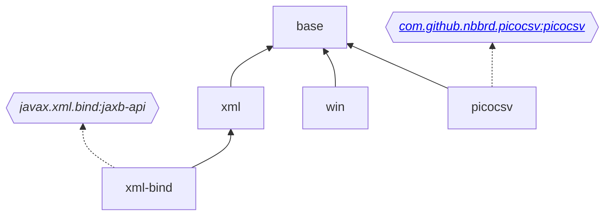

# Common I/O utilities for Java 

This library contains common code used for I/O operations in Java.  
While not being rocket science, its purpose is to be useful, well documented and well tested.

## Dependency graph

